# Choose Best classification Model
### Classification perform on Titanic data set


---


# ========*INDEX*========
[Explore Data Set](#explore-data-set)

[PreProcess DataSet / Data wrangling](#preprocess-dataset--data-wrangling)

[visualize Data Set](#visualize-data-set)

[Train Different  Models](#train-different--models)


# Explore Data Set

>  1-Import Libraries
> 
```python
import pandas as pd
import numpy as np
import seaborn as sns
import matplotlib.pyplot as plt
```
> 2-Data set Load

```python
df=sns.load_dataset("titanic")
df.head(3)
```

> 3-Apply different functions

```python
df.columns
df.dtypes
df.info()
df.describe
df.isnull().sum()
df.shape
df.memory_usage(deep=True)
```

# PreProcess DataSet / Data wrangling

> Fill empty values
  
> Age column contain 177 null values
  
> deck column contain deck 688 null values(remove more then 70% od data absent)

```python
df.drop(columns=['deck'],inplace=True)
# check
df.columns
df["age"] = df["age"].fillna(df["age"].mean())
df["embarked"] = df["embarked"].fillna(df["embarked"].mode()[0])
df["embark_town"] = df["embark_town"].fillna(df["embark_town"].mode()[0])
#check
df.isnull().sum()
```
# visualize Data Set

> Decide X & Y

```python
x=df[['pclass','sex','age','fare','sibsp','parch']]
y=df['survived']
```
> 1-Survival Count
```python
sns.countplot(x='sex', hue='survived', data=df)
plt.title("Survival Count by Sex((0 = No, 1 = Yes))")
plt.show()
```
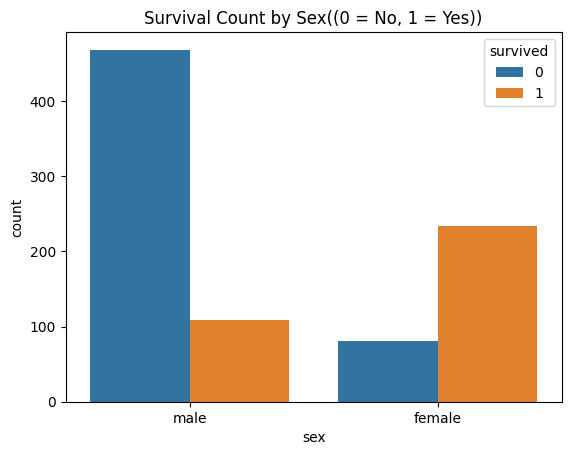

> 2-Survival Count by Passenger Class
```python
sns.countplot(x='pclass', hue='survived', data=df)
plt.title("Survival Count by Passenger Class")
plt.show()
```
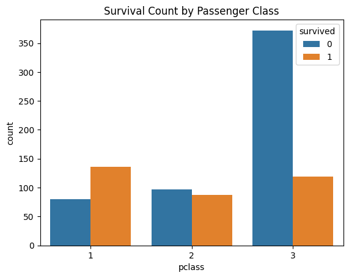

>3-Age Distribution by Survival
```python
sns.histplot(data=df, x='age', hue='survived', kde=True, bins=30)
plt.title("Age Distribution by Survival")
plt.show()
```
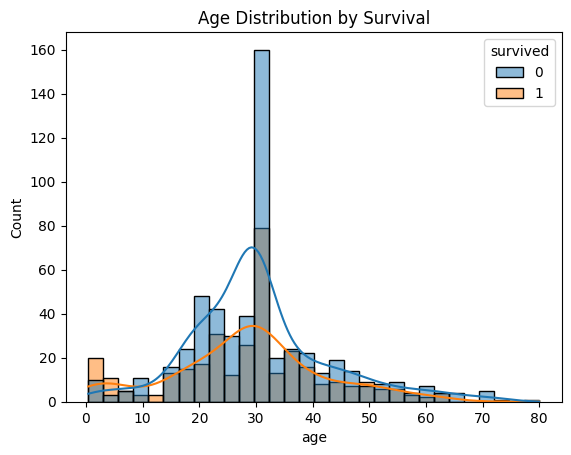

>4-Fare Distribution by Survival

```python
sns.histplot(data=df, x='fare', hue='survived', kde=True, bins=30)
plt.title("Fare Distribution by Survival")
plt.show()
```
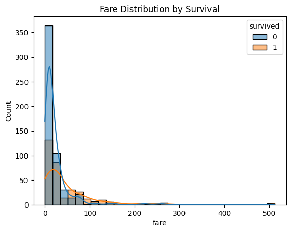

>5-Feature Correlation with Survival

```python
df['sex'] = df['sex'].map({'male': 0, 'female': 1})

plt.figure(figsize=(8,6))
sns.heatmap(df[['survived','pclass','age','sex','fare','sibsp','parch']].corr(), annot=True, cmap='coolwarm')
plt.title("Feature Correlation with Survival")
plt.show()
```
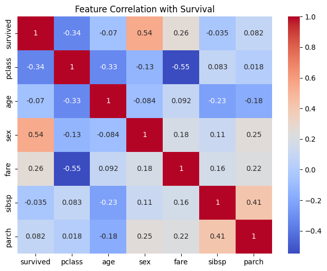

>6-PairPlot

```python
sns.pairplot(df[['pclass','sex','age','fare','sibsp','parch','survived']],hue='survived')
```
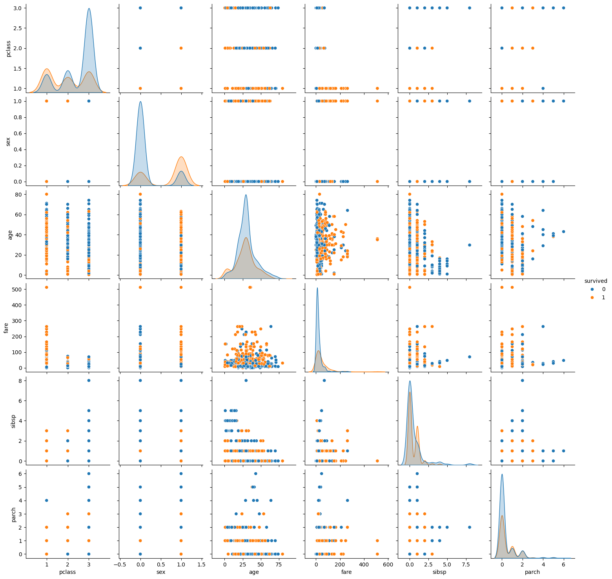

# Train Different  Models

 > Import model 
  
  1- Logistic Regression

  2- SVM

  3- Random Forest

  4- KNN
  
  5- Decision tree

  > Evolution Mfetrics
  
  1- Accuracy

  2-Preciision

  3- f1-score

  4- Classification Report

  5- Recall 

  ```python
  # Model Load & Differt Metrics to check Accuracy
from sklearn.model_selection import train_test_split
from sklearn.linear_model import LogisticRegression
from sklearn.ensemble import RandomForestClassifier
from sklearn.tree import DecisionTreeClassifier
from sklearn.neighbors import KNeighborsClassifier
from sklearn.svm import SVC
from sklearn.metrics import confusion_matrix,accuracy_score,classification_report,precision_score,recall_score,f1_score
# decide x & y
z=pd.get_dummies(x,columns=['sex'])
x=df[['pclass','sex','age','fare','sibsp','parch']]
y=df['survived']
# split data set Train & test
x_train,x_test,y_train,y_test=train_test_split(x,y,test_size=0.2,random_state=42)
```
> ACcuracy of All these models
```python
print(" *** ACcuracy of All these models *** ")
models=[LogisticRegression(),RandomForestClassifier(),DecisionTreeClassifier(),KNeighborsClassifier(),SVC()]
models_names=["LogisticRegression","RandomForestClassifier","DecisionTreeClassifier","KNeighborsClassifier","SVC"]
models_score=[]
for models,models_names in zip(models,models_names):
    models.fit(x_train,y_train)
    y_pred=models.predict(x_test)
    accuracy=accuracy_score(y_test,y_pred)
    models_score.append([models_names,accuracy])
    
sorted_models=sorted(models_score,key=lambda x:x[1],reverse=True)  
for model in sorted_models:
    print("Model:",model[0],"ACcuracy:",model[1])  
#     # *** ACcuracy of All these models *** 
# Model: LogisticRegression ACcuracy: 0.8100558659217877
# Model: RandomForestClassifier ACcuracy: 0.8100558659217877
# Model: DecisionTreeClassifier ACcuracy: 0.770949720670391
# Model: KNeighborsClassifier ACcuracy: 0.6983240223463687
# Model: SVC ACcuracy: 0.6536312849162011
```   

>Precision Score of All these models
```python
print(" *** Precision Score of All these models *** ")
models=[LogisticRegression(),RandomForestClassifier(),DecisionTreeClassifier(),KNeighborsClassifier(),SVC()]
models_names=["LogisticRegression","RandomForestClassifier","DecisionTreeClassifier","KNeighborsClassifier","SVC"]
models_score=[]
for models,models_names in zip(models,models_names):
    models.fit(x_train,y_train)
    y_pred=models.predict(x_test)
    precision=precision_score(y_test,y_pred)
    models_score.append([models_names,precision])
    
 sorted_models=sorted(models_score,key=lambda x:x[1],reverse=True)  
     for model in sorted_models:
         print("Model:",model[0],"precision:",model[1])  
# # #    *** Precision Score of All these models *** 
# # # Model: LogisticRegression precision: 0.803030303030303
# # # Model: RandomForestClassifier precision: 0.7941176470588235
# # # Model: SVC precision: 0.75
# # # Model: DecisionTreeClassifier precision: 0.7361111111111112
# # # Model: KNeighborsClassifier precision: 0.6666666666666666 
```
>f1 Score of All these models
```python
print(" *** f1 Score of All these models *** ")
models=[LogisticRegression(),RandomForestClassifier(),DecisionTreeClassifier(),KNeighborsClassifier(),SVC()]
models_names=["LogisticRegression","RandomForestClassifier","DecisionTreeClassifier","KNeighborsClassifier","SVC"]
models_score=[]
for models,models_names in zip(models,models_names):
    models.fit(x_train,y_train)
    y_pred=models.predict(x_test)
    f1=f1_score(y_test,y_pred)
    models_score.append([models_names,f1])
    
sorted_models=sorted(models_score,key=lambda x:x[1],reverse=True)  
for model in sorted_models:
    print("Model:",model[0],"f1:",model[1])  

#     *** f1 Score of All these models *** 
# Model: RandomForestClassifier f1: 0.7605633802816901
# Model: LogisticRegression f1: 0.7571428571428571
# Model: DecisionTreeClassifier f1: 0.7083333333333334
# Model: KNeighborsClassifier f1: 0.5970149253731343
# Model: SVC f1: 0.3673469387755102  
```
>Recall Score of All Models
```python
from sklearn.metrics import recall_score
from sklearn.linear_model import LogisticRegression
from sklearn.ensemble import RandomForestClassifier
from sklearn.tree import DecisionTreeClassifier
from sklearn.neighbors import KNeighborsClassifier
from sklearn.svm import SVC

print("*** Recall Score of All Models ***")

models_list = [
    LogisticRegression(max_iter=1000),
    RandomForestClassifier(),
    DecisionTreeClassifier(),
    KNeighborsClassifier(),
    SVC()
]

models_names = [
    "LogisticRegression",
    "RandomForestClassifier",
    "DecisionTreeClassifier",
    "KNeighborsClassifier",
    "SVC"
]

models_scores = []

for model, name in zip(models_list, models_names):
    model.fit(x_train, y_train)
    y_pred = model.predict(x_test)
    recall_val = recall_score(y_test, y_pred)
    models_scores.append([name, recall_val])

sorted_models = sorted(models_scores, key=lambda x: x[1], reverse=True)

for model in sorted_models:
    print("Model:", model[0], "Recall Score:", model[1])

# *** Recall Score of All Models ***
# Model: LogisticRegression Recall Score: 0.7162162162162162
# Model: RandomForestClassifier Recall Score: 0.7162162162162162
# Model: DecisionTreeClassifier Recall Score: 0.6891891891891891
# Model: KNeighborsClassifier Recall Score: 0.5405405405405406
# Model: SVC Recall Score: 0.24324324324324326
```
>Confusion Metrix of All these Models
```python
from sklearn.metrics import confusion_matrix
import seaborn as sns
import matplotlib.pyplot as plt

# List of models and names
models_list = [
    LogisticRegression(max_iter=1000),
    RandomForestClassifier(),
    DecisionTreeClassifier(),
    KNeighborsClassifier(),
    SVC()
]

models_names = [
    "LogisticRegression",
    "RandomForestClassifier",
    "DecisionTreeClassifier",
    "KNeighborsClassifier",
    "SVC"
]

# Evaluate models
for model, name in zip(models_list, models_names):
    model.fit(x_train, y_train)
    y_pred = model.predict(x_test)
    
    cm = confusion_matrix(y_test, y_pred)
    print(f"Confusion Matrix for {name}:")
    print(cm)
    
    # Heatmap visualization
    plt.figure(figsize=(4,3))
    sns.heatmap(cm, annot=True, fmt="d", cmap="Blues")
    plt.title(f"Confusion Matrix - {name}")
    plt.xlabel("Predicted")
    plt.ylabel("Actual")
    plt.show()
```
> Logistic Regression

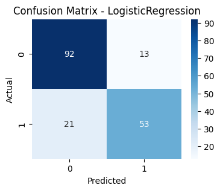

>RandomForestClassifier

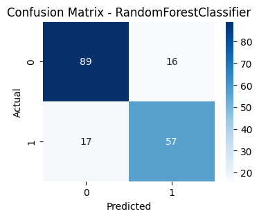

>DecisionTreeClassifier

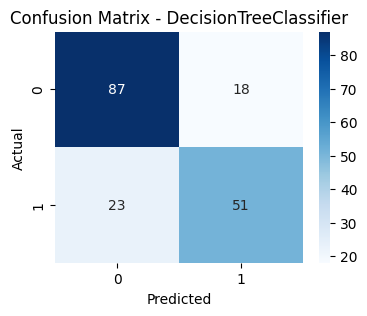

>KNeighborsClassifier

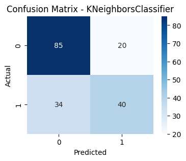

>SVC

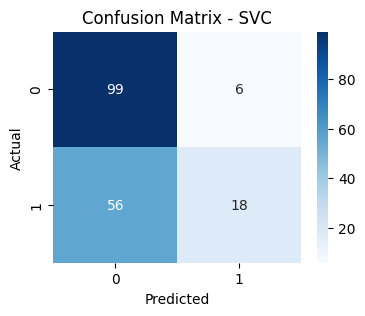